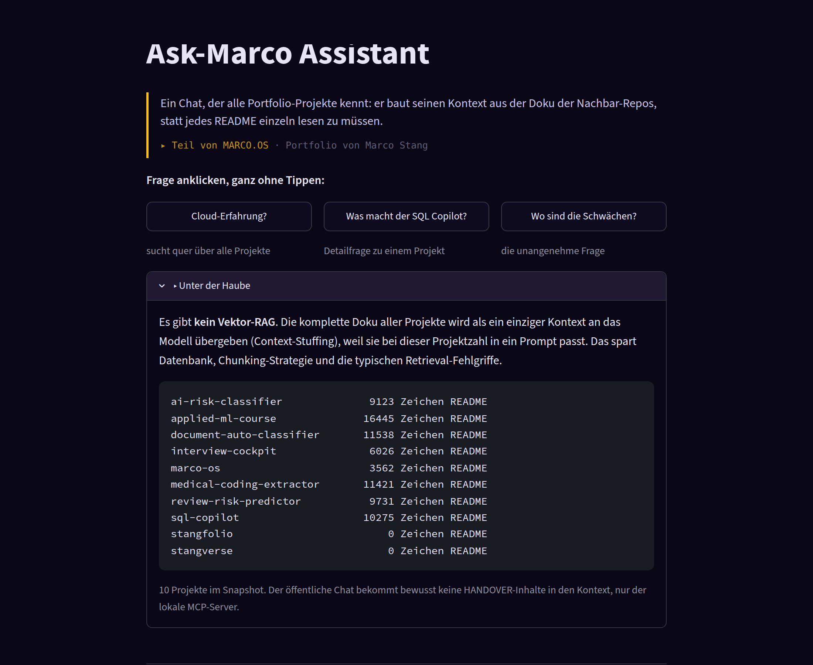
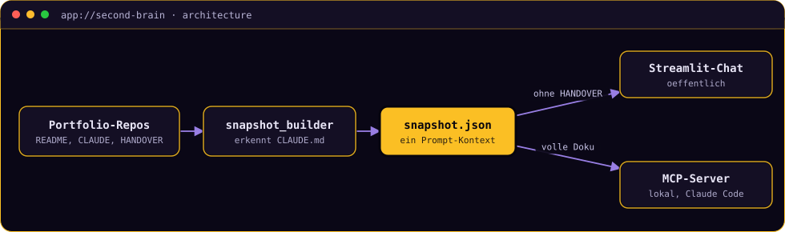

# Ask-Marco Assistant

**Ein Chat, der alle Portfolio-Projekte kennt: er baut sich seinen Kontext aus der Doku der
Nachbar-Repos und liefert dasselbe Wissen zusätzlich als MCP-Server, der öffentliche Chat
bekommt dabei bewusst weniger zu sehen als der lokale.**


[](https://second-brain-projects.streamlit.app/)

> **▶ [Demo ausprobieren](https://second-brain-projects.streamlit.app/)**
> Frag zum Beispiel „welche Projekte zeigen Cloud-Erfahrung?" oder „was macht der SQL
> Copilot?", statt jedes README einzeln zu lesen.
> *Streamlit Free Tier: der erste Aufruf kann ein paar Sekunden zum Aufwachen brauchen.*

<!-- TODO(Marco): Screenshot einfuegen, dann diese Zeile durch das Bild ersetzen:
      -->

<details>
<summary><b>🇬🇧 English summary</b></summary>

A "second brain" that knows every project in this portfolio. A builder scans the sibling
repositories for README, CLAUDE.md and HANDOVER files and compiles them into a single
snapshot, which is then passed to an LLM as full context instead of being retrieved through
a vector database. The same knowledge is exposed as an MCP server for Claude Code and
Claude Desktop, with one deliberate difference: the public chat never sees HANDOVER files.
Full write-up in German below.
</details>

---

## In 30 Sekunden

Wer ein Portfolio mit acht Projekten prüft, will selten alle READMEs lesen. Dieser Chat
beantwortet Fragen quer über alle Projekte, weil er ihre komplette Doku als Kontext
mitbekommt. Ein Builder scannt dafür die Nachbar-Repos, erkennt Projekte an ihrer
`CLAUDE.md` und schreibt README, CLAUDE.md und HANDOVER in einen gemeinsamen Snapshot.

Dasselbe Wissen steht zusätzlich als MCP-Server bereit, sodass jeder MCP-fähige Client wie
Claude Code oder Claude Desktop direkt danach fragen kann.

## Die zentrale Entscheidung: der öffentliche Chat sieht weniger

Der Snapshot enthält auch `HANDOVER.md`-Dateien, und die sind für den internen
Wiedereinstieg geschrieben: Betriebsdetails, Deployment-Schritte, gelegentlich
Cloud-Account-IDs. Für den lokalen MCP-Server ist genau das wertvoll, im öffentlich
erreichbaren Streamlit-Chat wäre es ein Leck.

Deshalb ist die Trennung nicht in den Prompt gewandert („bitte erwähne keine internen
Details"), sondern in die Datenschicht: Der öffentliche Chat bekommt die HANDOVER-Inhalte
gar nicht erst in den Kontext. Was nicht im Prompt steht, kann auch kein noch so geschickt
formulierter Nutzer herauslocken.

<details>
<summary><b>▸ Deep Dive: warum Context-Stuffing statt Vektor-RAG</b></summary>

Der naheliegende Reflex bei „Dokumente durchsuchbar machen" ist eine Vektor-Datenbank. Bei
acht Projekten ist das aber Overengineering: Die komplette Doku passt in ein einziges
Prompt. Context-Stuffing spart damit eine Datenbank, einen Embedding-Schritt, eine
Chunking-Strategie und die typischen Retrieval-Fehler, bei denen die relevante Passage
schlicht nicht gefunden wird.

Der Preis ist Skalierung: Ab einer gewissen Projektzahl passt der Snapshot nicht mehr ins
Kontextfenster, und dann wird Retrieval unvermeidlich. Diese Grenze ist bekannt und in den
Limitierungen benannt, statt sie vorsorglich mit Infrastruktur zu erschlagen, die heute
niemand braucht.

Module: `snapshot.py` (Pydantic-Schema), `snapshot_builder.py` (Scan der Nachbar-Repos),
`llm.py` (provider-agnostische Anbindung), `answering.py` (Prompt und Antwortlogik),
`app.py` (Streamlit-UI), `mcp_server.py` (`list_projects`, `ask_about_projects`).
</details>

## Architektur



Der Snapshot wird bewusst manuell gebaut und mit eingecheckt. Dadurch ist reproduzierbar,
welchen Wissensstand eine deployte Version hatte.

## Was es kann, und was nicht

Der aktuelle Snapshot deckt **10 Repositories** ab, davon 8 Portfolio-Projekte. Die
Test-Suite läuft komplett ohne LLM-API-Key und ohne Netzwerk, LLM-Aufrufe sind in allen
Tests durch einfache Fakes ersetzt.

Klassische Retrieval-Metriken (Recall@k, MRR) gibt es hier bewusst nicht: Es wird nichts
abgerufen, der gesamte Kontext ist immer vollständig im Prompt. Die Antwortqualität hängt
damit am Modell, nicht an einer Suchkomponente.

**Was dieses Projekt nicht ist:** Der Snapshot aktualisiert sich nicht selbst, nach
Änderungen in anderen Repos muss er neu gebaut werden. Es gibt kein Vektor-RAG, bei stark
wachsender Projektzahl würde der Kontext irgendwann nicht mehr passen. Und es durchsucht
nur Projekt-Doku, keinen Quellcode im Volltext.

## Selbst ausprobieren

Einmalig: `python -m venv .venv`, `.venv/Scripts/python.exe -m pip install -e ".[dev]"` und
`.env` aus [`.env.example`](.env.example) anlegen.

```bash
.venv/Scripts/python.exe -m pytest tests/ -v         # ohne LLM-Key lauffähig
.venv/Scripts/python.exe scripts/build_snapshot.py   # data/snapshot.json neu bauen
.venv/Scripts/python.exe -m streamlit run app.py     # Chat-Demo
```

---

```console
marco@portfolio:~$ open marco-os --project second-brain
```

**[▸ Dieses Projekt in MARCO.OS öffnen](https://maggostang-droid.github.io/marco-os/#second-brain)**,
dem interaktiven Portfolio von Marco Stang. Dort läuft dieser Chat direkt im
Ask-Marco-Fenster.

**Schwesterprojekte:**
[SQL Copilot](https://github.com/maggostang-droid/sql-copilot) (LangGraph-Agent mit Guardrails) ·
[Review Risk Predictor](https://github.com/maggostang-droid/review-risk-predictor) (erklärbares ML, React/FastAPI) ·
[Document Auto-Classifier](https://github.com/maggostang-droid/document-auto-classifier) (serverlos auf AWS)

<sub>Marco Stang · Dr.-Ing. · [LinkedIn](https://www.linkedin.com/in/marco-stang) · stang.marco@t-online.de · MIT-Lizenz</sub>
