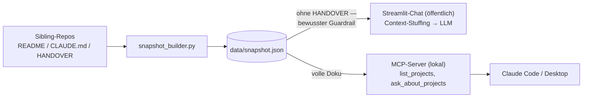

# Ask-Marco Assistant

Portfolio-Projekt von Marco Stang für Bewerbungen auf AI/KI-Rollen (ggf.
auch KI-Transformations-Rollen).

<!-- TODO(Marco): Screenshot der Chat-Demo hier einfügen:
      -->

🔗 **[Projektseite](https://maggostang-droid.github.io/ask-marco-assistant/)**

## In 30 Sekunden

Ein "second brain", das alle fertigen Portfolio-Projekte von Marco kennt —
frag es direkt im Chat, z.B. "welche Projekte zeigen Cloud-Erfahrung?" oder
"was macht der SQL Copilot?", statt jedes README einzeln zu lesen. Dasselbe Wissen
ist zusätzlich als MCP-Server abrufbar, sodass jeder MCP-fähige Client
(Claude Code, Claude Desktop) direkt danach fragen kann.

## Live-Demo

🔗 **[second-brain-projects.streamlit.app](https://second-brain-projects.streamlit.app/)**

Hinweis: Streamlit Community Cloud (Free Tier) schläft nach Inaktivität
ein — der erste Ladevorgang kann ein paar Sekunden dauern.

## Was das Tool macht

1. Baut aus README/CLAUDE.md/HANDOVER aller anderen Portfolio-Repos einen
   Snapshot (`data/snapshot.json`).
2. Beantwortet Fragen im Chat, indem der komplette Snapshot als Kontext an
   ein LLM geht (Context-Stuffing statt Vektor-RAG — bei aktuell 8 Projekten
   passt alles in ein Prompt).
3. Exponiert dasselbe Wissen zusätzlich über einen MCP-Server
   (`list_projects`, `ask_about_projects`) für Claude Code/Desktop.

Der öffentliche Chat bekommt dabei bewusst kein `HANDOVER.md` in den
Prompt (kann Betriebsdetails wie Cloud-Account-IDs enthalten) — nur der
lokale MCP-Server sieht die volle Doku inklusive HANDOVER.



## Architektur

- `src/second_brain/snapshot.py` — Pydantic-Schema + `load_snapshot()`
- `src/second_brain/snapshot_builder.py` — scannt Sibling-Repos, baut den Snapshot
- `src/second_brain/llm.py` — provider-agnostische LLM-Anbindung
- `src/second_brain/answering.py` — Context-Stuffing-Prompt + Antwortlogik
- `app.py` — Streamlit-Chat-UI (öffentlich)
- `src/second_brain/mcp_server.py` — MCP-Server (`list_projects`, `ask_about_projects`)

## Quickstart

```bash
python -m venv .venv
.venv/Scripts/python.exe -m pip install -e ".[dev]"
cp .env.example .env  # LLM_PROVIDER/LLM_MODEL/API-Key eintragen

.venv/Scripts/python.exe -m pytest tests/ -v          # komplette Test-Suite, kein LLM/Netzwerk nötig
.venv/Scripts/python.exe scripts/build_snapshot.py     # data/snapshot.json neu bauen
.venv/Scripts/python.exe -m streamlit run app.py       # Chat-Demo
```

## Tests

`pytest tests/` läuft komplett ohne LLM-API-Key/Netzwerk (LLM-Aufrufe sind
in allen Tests durch einfache Fakes ersetzt).

## Weiterführende Doku

- Design-Spec: `docs/superpowers/specs/2026-07-29-second-brain-design.md`
- Implementierungsplan: `docs/superpowers/plans/2026-07-29-second-brain-implementation.md`

## Limitierungen

- Snapshot wird manuell gebaut, kein automatisches Aktualisieren bei
  Änderungen in anderen Repos.
- Kein Vektor-RAG — bei stark wachsender Projektzahl würde der Snapshot
  irgendwann nicht mehr komplett ins Prompt passen (aktuell bei 8
  Projekten kein Problem).
- Nur Projekt-Metadaten/Doku, keine Volltext-Code-Suche.

## Portfolio-Kontext

Dieses Projekt ist Teil von **[MARCO.OS](https://maggostang-droid.github.io/marco-os/)**,
dem interaktiven Portfolio von Marco Stang — dort läuft dieser Chat direkt
im "Ask-Marco"-Fenster. Schwesterprojekte (alle im Snapshot enthalten):

- [SQL Copilot](https://github.com/maggostang-droid/sql-copilot) — LangGraph-Agent für Text-to-SQL mit Guardrails und Selbstkorrektur
- [Review Risk Predictor](https://github.com/maggostang-droid/review-risk-predictor) — erklärbare ML-Risikovorhersage (React/FastAPI)
- [Document Auto-Classifier](https://github.com/maggostang-droid/document-auto-classifier) — serverlose Dokumenten-Pipeline auf AWS (S3 → Lambda → Claude → DynamoDB)
